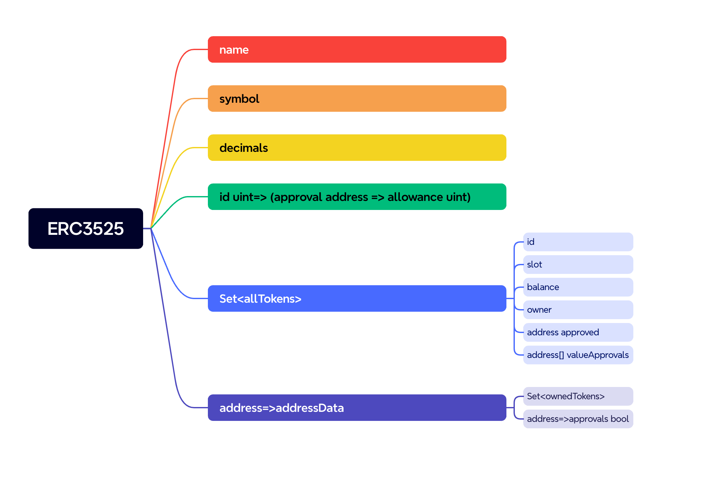

https://eips.ethereum.org/EIPS/eip-3525



# transferFrom

## transferFrom-3525
第一个允许在同一槽内从一个token（[0）到另一个token（[1）的值传递，导致源token的值减少，目的token的值增加。


```javascript
/**
* @notice 将指定token中的价值转移到另一个指定的token中，且操作在相同的槽位上进行。
* @dev 调用者必须是当前所有者、被授权的操作员或者已经被批准了整个`_fromTokenId`或部分的价值转移权限。
* 若 `_fromTokenId` 或 `_toTokenId` 为零token id或不存在，则会回滚操作。
* 若 `_fromTokenId` 和 `_toTokenId` 的槽位不匹配，也会回滚操作。
* 若 `_value` 超过了 `fromTokenId` 或其对操作者的允许价值，则会回滚操作。
* 该函数执行后，必须触发`TransferValue`事件。
* @param _fromTokenId 需要转移价值的token id
* @param _toTokenId 接受转移价值的目标token id
* @param _value 被转移的价值量
*/
function transferFrom(uint256 fromTokenId_,uint256 toTokenId_,uint256 value_)
```

```javascript
/**
* @notice 将指定token中的价值转移到一个地址。调用者需要确认`_to`可以接收ERC3525代币。
* @dev 这个函数必须为 `_to` 创建一个新的ERC3525 token，用于接收到转移的价值。
* 若 `_fromTokenId` 为零token id或不存在，则会回滚操作。
* 若 `_to` 地址为零地址，则会回滚操作。
* 若 `_value` 超过了 `fromTokenId` 或其对操作者的允许价值，也会回滚操作。
* 这个函数执行后必须触发 `Transfer` 和 `TransferValue` 事件。
* @param _fromTokenId 需要转移价值的token id
* @param _to 转移价值的目标地址
* @param _value 被转移的价值量
* @return 创建给 `_to` 接收转移价值的新token id
*/
function transferFrom(uint256 fromTokenId_,address to_,uint256 value_)
```
第二种方法允许从一个token（_fromTokenId)到一个地址（_to)进行价值转移。实际上，价值被转移到这个地址所拥有的token中，而且应该返回目的token的id。


## transferFrom-721

function transferFrom(address from_,address to_,uint256 tokenId_)

# metadata
```js
/**
 * @title ERC-3525半同质化代币标准，针对元数据的可选扩展
 * @dev 对于任何希望支持查询ERC-3525合约以及指定槽位的统一资源标识符（URI）的合约接口。
 * 由于智能合约中存储的数据比集中系统中存储的数据更可靠，
 * 因此建议将包括`contractURI`、`slotURI`和`tokenURI在内的元数据直接以JSON格式返回，
 * 而不是通过指向任何在集中式系统中存储资源的URL来返回。
 * 可查看 https://eips.ethereum.org/EIPS/eip-3525了解详情。
 * 注意：此接口的ERC-165标识符为0xe1600902。
 */
```
## metadata-3525
### a.contractURI
```js
/**
* @notice 返回当前ERC3525合约的统一资源标识符（URI）。
* @dev 这个函数应当返回以 `data:application/json;` 为首的JSON格式的此合约URI。
* 参见https://eips.ethereum.org/EIPS/eip-3525 对于合约URI的JSON模式，请查看EIP文档。
* @return 当前ERC3525合约的JSON格式URI
*/
function contractURI() external view returns (string memory);
```
```json
{
  "title": "Contract Metadata",
  "type": "object",
  "properties": {
    "name": {
      "type": "string",
      "description": "Contract Name"
    },
    "description": {
      "type": "string",
      "description": "Describes the contract"
    },
    "image": {
      "type": "string",
      "description": "Optional. Either a base64 encoded imgae data or a URI pointing to a resource with mime type image/* representing what this contract represents."
    },
    "external_link": {
      "type": "string",
      "description": "Optional. A URI pointing to an external resource."
    },
    "valueDecimals": {
      "type": "integer",
      "description": "The number of decimal places that the balance should display - e.g. 18, means to divide the token value by 1000000000000000000 to get its user representation."
    }
  }
}
```

### b.slotURI
```js
/**
* @notice 返回指定槽位的统一资源标识符（URI）。
* @dev 这个函数应当返回以 `data:application/json;` 为首的`_slot`的JSON格式URI。
* 参见 https://eips.ethereum.org/EIPS/eip-3525 对于槽位URI的JSON模式，请查看EIP文档。
* @return `_slot`的JSON格式URI
*/
function slotURI(uint256 _slot) external view returns (string memory);
```
```json
{
  "title": "Slot Metadata",
  "type": "object",
  "properties": {
    "name": {
      "type": "string",
      "description": "Identifies the asset category to which this slot represents"
    },
    "description": {
      "type": "string",
      "description": "Describes the asset category to which this slot represents"
    },
    "image": {
      "type": "string",
      "description": "Optional. Either a base64 encoded imgae data or a URI pointing to a resource with mime type image/* representing the asset category to which this slot represents."
    },
    "properties": {
      "type": "array",
      "description": "Each item of `properties` SHOULD be organized in object format, including name, description, value, order (optional), display_type (optional), etc."
      "items": {
        "type": "object",
        "properties": {
          "name": {
            "type": "string",
            "description": "The name of this property."
          },
          "description": {
            "type": "string",
            "description": "Describes this property."
          }
          "value": {
            "description": "The value of this property, which may be a string or a number."
          },
          "is_intrinsic": {
            "type": "boolean",
            "description": "According to the definition of `slot`, one of the best practice to generate the value of a slot is utilizing the `keccak256` algorithm to calculate the hash value of multi properties. In this scenario, the `properties` field should contain all the properties that are used to calculate the value of `slot`, and if a property is used in the calculation, is_intrinsic must be TRUE."
          },
          "order": {
            "type": "integer",
            "description": "Optional, related to the value of is_intrinsic. If is_intrinsic is TRUE, it must be the order of this property appeared in the calculation method of the slot."
          },
          "display_type": {
            "type": "string",
            "description": "Optional. Specifies in what form this property should be displayed."
          }
        }
      }
    }
  }
}
```

## metadata-721
```js
/**
* @notice 对特定资产具有唯一标识的统一资源标识符（URI）。
* @dev 若 `_tokenId` 不是有效的NFT，则会抛出异常。URI定义在RFC3986中。URI可能指向一与"ERC721元数据JSON模式"兼容的JSON文件。
*/
function tokenURI(uint256 _tokenId) external view returns (string memory);
```
```json
{
  "title": "Token Metadata",
  "type": "object",
  "properties": {
    "name": {
      "type": "string",
      "description": "Identifies the asset to which this token represents"
    },
    "description": {
      "type": "string",
      "description": "Describes the asset to which this token represents"
    },
    "image": {
      "type": "string",
      "description": "Either a base64 encoded imgae data or a URI pointing to a resource with mime type image/* representing the asset to which this token represents."
    },
    "balance": {
      "type": "integer",
      "description": "THe value held by this token."
    },
    "slot": {
      "type": "integer",
      "description": "The id of the slot that this token belongs to."
    },
    "properties": {
      "type": "object",
      "description": "Arbitrary properties. Values may be strings, numbers, objects or arrays. Optional, you can use the same schema as the properties section of ERC-3525 Metadata JSON Schema for slotURI(uint) if you need a better description attribute."
    }
  }
}
```