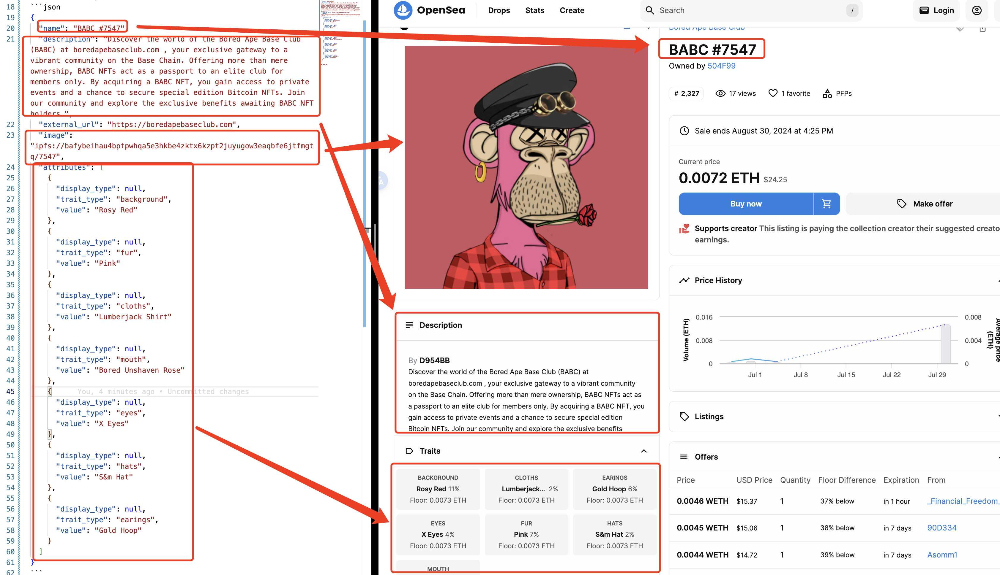

# 提出AI领域的metadata标准
ref: https://eips.ethereum.org/EIPS/eip-5625

ref: https://eips.ethereum.org/EIPS/eip-3525#metadata

- model
- data
- application
- license

# opensea metadata standards
https://docs.opensea.io/docs/metadata-standards

## token URI

你ERC721中的tokenURI函数或者是你的ERC1155合约的uri函数应该返回一个HTTP或IPFS的URL。 当查询这个URL时，它应该返回一个JSON数据包，包含你的token的元信息。

721 token URI example:`ipfs://bafybeiacrqba67k6p7vu523mnumu36a34hcanowg4axxl2z3yse6ot437y/7547`

which stores a json as follows:
```json
{
  "name": "BABC #7547",
  "description": "Discover the world of the Bored Ape Base Club (BABC) at boredapebaseclub.com , your exclusive gateway to a vibrant community on the Base Chain. Offering more than mere ownership, BABC NFTs act as a passport to an elite club for members only. By acquiring a BABC NFT, you gain access to private events and a chance to secure special edition Bitcoin NFTs. Join our community and explore the exclusive benefits awaiting BABC NFT holders.",
  "external_url": "https://boredapebaseclub.com",
  "image": "ipfs://bafybeihau4bptpwhqa5e3hkbe4zktx6kzpt2juyugow3eaqbfe6jtfmgtq/7547",
  "attributes": [
    {
      "display_type": null,
      "trait_type": "background",
      "value": "Rosy Red"
    },
    {
      "display_type": null,
      "trait_type": "fur",
      "value": "Pink"
    },
    {
      "display_type": null,
      "trait_type": "cloths",
      "value": "Lumberjack Shirt"
    },
    {
      "display_type": null,
      "trait_type": "mouth",
      "value": "Bored Unshaven Rose"
    },
    {
      "display_type": null,
      "trait_type": "eyes",
      "value": "X Eyes"
    },
    {
      "display_type": null,
      "trait_type": "hats",
      "value": "S&m Hat"
    },
    {
      "display_type": null,
      "trait_type": "earings",
      "value": "Gold Hoop"
    }
  ]
}
```


## Pause trading

https://docs.opensea.io/docs/metadata-standards#disable-trading-for-staked-or-locked-tokens

```
// ERC-5192 (recommended for gas efficiency)
event Locked(uint256 tokenId);
event Unlocked(uint256 tokenId);

// ERC-5753
event Lock(address indexed unlocker, uint256 indexed id);
event Unlock(uint256 indexed id);

// Others
event TokenLocked(uint256 indexed tokenId, address indexed approvedContract);
event TokenUnlocked(uint256 indexed tokenId, address indexed approvedContract);

event Stake(uint256 indexed tokenId);
event Unstake(uint256 indexed tokenId, uint256 stakedAtTimestamp, uint256 removedFromStakeAtTimestamp);

event Staked(address indexed user, uint256[] tokenIds, uint256 stakeTime);
event Unstaked(address indexed user, uint256[] tokenIds);
```


